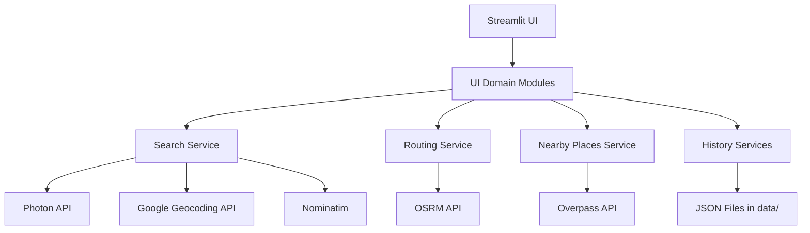

# T14 Map Explorer - Software Documentation

## 1. Document Purpose
This document provides complete software documentation for T14 Map Explorer, including:
- Product scope and capabilities
- End-to-end user use cases
- Architecture and module segregation
- Data artifacts and flows
- Assumptions, constraints, and risks
- Future extension plan for multi-leg journey planning

## 2. Product Overview
T14 Map Explorer is a Streamlit-based web application for map search, routing, pin capture, and nearby place exploration.

### 2.1 Core Value
- Quickly discover locations and points of interest
- Plan routes and understand travel distance/time
- Reuse history and map interactions for iterative trip planning

### 2.2 Primary Users
- Individual travelers and commuters
- Tour planners and event coordinators
- Users exploring nearby facilities around chosen map points

## 3. Scope

### 3.1 In-Scope (Current)
- Location search with geocoding fallback chain
- Nearby places retrieval around searched/clicked points
- Pin capture on map click with coordinate extraction
- Route calculation for start/end and multi-waypoint journeys
- Role-based pins (START/STOP/END) with editable labels
- Per-leg route focus and map re-centering
- Journey leg splitting by distance/time with generated breakpoints
- Nearby places retrieval for generated breakpoints
- Auto-center overall journey on zoom-out threshold
- Search history and route history persistence
- Persistent local nearby cache for reduced repeated API calls
- About page with capability summary and update history

### 3.2 In-Scope (Planned / Design-Ready)
- Higher-fidelity leg splitting using route polyline geometry sampling
- Persisted journey-plan history artifact

### 3.3 Out-of-Scope (Current)
- Turn-by-turn navigation with real-time traffic rerouting
- User account/authentication and cloud sync
- Multi-user collaboration and shared itineraries

## 4. Use Cases

## 4.1 UC-01: Search Place and Show Nearby Places
### Goal
User searches for a place and sees relevant nearby places automatically.

### Preconditions
- App is running
- Internet access available

### Main Flow
1. User enters a place name in Search.
2. App geocodes the query using fallback providers.
3. App centers map at found coordinates.
4. App queries nearby places within selected radius.
5. App displays nearby places list and markers.

### Postconditions
- Map center updated
- Search recorded to search history
- Nearby places stored in session state

### Status
Implemented.

## 4.2 UC-02: Drop or Select Pins and Retrieve Coordinates
### Goal
User gets coordinate information by dropping pins or selecting nearby place markers/list entries.

### Preconditions
- Map is visible

### Main Flow
1. User clicks map to drop a pin.
2. App captures latitude/longitude from map click event.
3. App stores pin in captured pin list.
4. App refreshes nearby places around the new pin.

### Alternate Flow
1. User clicks nearby place entry (list action).
2. App centers map to that place coordinate.
3. User can convert that location into route point via pin workflow.

### Postconditions
- Coordinates available in captured pins and UI

### Status
Implemented (map click pin capture and nearby place coordinate usage).

## 4.3 UC-03: Select Start, End, and Interesting Points for Journey
### Goal
User defines a journey route with required points.

### Current Behavior
- Start, Stop, End roles are assigned per pin.
- Journey route is built as ordered waypoints: START -> STOPS -> END.
- Pin labels are user-editable and displayed in route summaries/markers.

### Status
Implemented.

## 4.4 UC-04: Calculate Distance and Show Nearby Places Along Dropped Pins
### Goal
User sees journey distance/time and contextual places near selected points.

### Main Flow
1. User defines route start/end.
2. App calculates route via OSRM.
3. App displays total distance and duration.
4. App shows nearby places around selected map context (latest pin/search center).

### Status
Implemented for route totals, per-leg focus, and pin-centric nearby places.

## 4.5 UC-05: Break Journey into Legs by Time/Distance and Show Nearby per Breakpoint
### Goal
User splits a long route into manageable legs and discovers places near each leg breakpoint.

### Implemented Functional Behavior
1. User sets split mode: by distance (e.g., every 30 km) or by time (e.g., every 45 min).
2. App interpolates breakpoints on route geometry.
3. App adds breakpoint markers.
4. App queries nearby places around each breakpoint.
5. App displays a per-leg summary table and per-breakpoint nearby recommendations.

### Proposed Algorithm (High Level)
1. Compute full route geometry (polyline coordinates + distance + duration).
2. Convert split rule into target interval:
   - Distance mode: fixed kilometer interval
   - Time mode: interval in minutes mapped proportionally to route distance
3. Traverse route coordinates cumulatively and emit breakpoints at each interval.
4. For each breakpoint:
   - Query nearby places via Overpass
   - Attach top categorized places to leg record

### Proposed Data Model
```json
{
  "journey_id": "uuid",
  "split_mode": "distance|time",
  "split_value": 30,
  "legs": [
    {
      "leg_index": 1,
      "start": [lat, lon],
      "end": [lat, lon],
      "distance_km": 27.4,
      "duration_min": 32,
      "nearby": [{"name": "...", "category": "..."}]
    }
  ]
}
```

### Status
Implemented (v1 interpolation approach).

## 4.6 UC-06: Make Journey Decisions Using Computed Results
### Goal
User decides stop strategy and final route plan using route metrics and nearby place insights.

### Decision Inputs
- Total route distance/time
- Leg-level distance/time (planned feature)
- Nearby points of interest around pins and breakpoints

### Expected Outcomes
- Improved route comfort and stop planning
- Better context-aware travel decisions

### Status
Implemented.

## 5. System Architecture

## 5.1 Runtime Architecture (Current)


## 5.2 Layered View
- Presentation Layer: Streamlit pages and components
- Application Layer: UI orchestration and workflow handlers
- Domain/Service Layer: Search, routing, nearby, history helpers
- Integration Layer: External APIs (Photon/Nominatim/OSRM/Overpass)
- Persistence Layer: Local JSON files

## 6. Module Segregation (Current Refactor)

## 6.1 Entry Points
- app.py: Main map experience orchestration
- pages/1_About.py: About page and update timeline display

## 6.2 UI Domain Modules
- src/ui/session_state.py: Session defaults and initialization
- src/ui/styles.py: Shared styles
- src/ui/sidebar_sections.py: Search, location, route planner, histories
- src/ui/map_sections.py: Map rendering and click interaction
- src/ui/detail_sections.py: Backward-compatible detail entrypoints
- src/ui/details/shared.py: Shared helper functions for pins/journey/nearby
- src/ui/details/nearby_section.py: Nearby listing UI + actions
- src/ui/details/pins_journey_section.py: Captured pins and journey builder UI
- src/ui/main_sections.py: Header, location info panel, top action controls

## 6.3 Service/Utility Modules
- src/utils/search_utils.py: Geocoding strategy and provider fallback
- src/utils/location_utils.py: IP-based user location detection
- src/utils/routing_utils.py: Route retrieval and map route rendering
- src/utils/nearby_places_utils.py: Overpass query and category mapping
- src/utils/history_utils.py: Search history file operations
- src/utils/route_history_utils.py: Route history file operations
- src/utils/changelog_utils.py: Update history file operations

## 7. Data Artifacts and Ownership
- data/search_history.json: Search records
- data/route_history.json: Saved routes
- data/update_history.json: Release/update entries for About page
- data/nearby_cache.json: Persistent nearby lookup cache

### 7.1 Data Governance Assumptions
- Data is local to deployment environment
- No user authentication currently
- No PII beyond map coordinates and query text intentionally stored

## 8. Key Workflows

## 8.1 Search to Nearby Workflow
1. Input query
2. Resolve coordinates via provider chain
3. Update map center/zoom
4. Save search history
5. Query nearby places and render

## 8.2 Route Workflow
1. Resolve start/end coordinates
2. Request route from OSRM
3. Render polyline/markers
4. Persist route to history
5. Display distance and duration

## 8.3 Pin Workflow
1. Capture map click coordinates
2. Store in captured pin list
3. Query nearby around latest pin
4. Allow pin-to-start/pin-to-end assignment

## 9. Functional Requirements
- FR-01: Must geocode place queries with fallback behavior
- FR-02: Must render map layers and interactions
- FR-03: Must calculate and display route distance/time
- FR-04: Must support pin capture and coordinate display
- FR-05: Must show categorized nearby places around selected context
- FR-06: Must persist and manage search/route history
- FR-07: Must provide About page with capabilities and updates
- FR-08: Must split journey into legs by time/distance and compute per-leg nearby places
- FR-09: Must support editable pin labels and role-based route building
- FR-10: Must support persistent nearby cache across app restarts

## 10. Non-Functional Requirements
- NFR-01: Typical search response under 5 seconds (network dependent)
- NFR-02: Graceful fallback when external APIs fail
- NFR-03: Clear error messages for recoverable failures
- NFR-04: Maintainable code with domain-based segregation
- NFR-05: Deterministic widget keys for Streamlit components

## 11. Assumptions and Constraints

### 11.1 Assumptions
- External API endpoints are reachable
- OpenStreetMap/OSRM data quality is sufficient for route planning
- Local file system is writable for history persistence
- Single-user session model per runtime instance is acceptable

### 11.2 Constraints
- Rate limits may apply for external services
- No guaranteed SLA from public free endpoints
- IP-based location is approximate and may be inaccurate

## 12. Risks and Mitigations
- External API downtime -> Keep fallback chains and user warnings
- Inconsistent geocoding results -> Surface providers and support manual adjustment via pin drop
- Large route/pin state in session -> Cap histories and prune stale artifacts

## 13. Testing Strategy

### 13.1 Current Practical Validation
- Smoke run via Streamlit startup
- UI interaction checks (search, pin, route, history)

### 13.2 Recommended Automated Tests
- Unit tests for service modules (search/routing/nearby parsing)
- Contract-like tests for API response parsing with fixtures
- Session-state behavior tests for key workflows

## 14. Deployment and Operations Notes
- Runtime: Python 3.14 + .venv
- Startup scripts:
  - run_app.bat
  - run_app.bat --sync (install/update dependencies)
  - run_app.bat --fresh (recreate environment)

## 15. Architecture Notes for Next Journey-Leg Enhancement

### 15.1 Existing Modules
- src/ui/details/pins_journey_section.py
  - Inputs for split mode/value
  - Per-leg summary and focus actions
  - Breakpoint nearby rendering

### 15.2 Candidate Improvements
- src/journey_planner_utils.py
  - Polyline-aware splitting instead of linear interpolation
  - Better ETA distribution across split points
- data/journey_history.json (optional)
  - Persist segmented journey plans

### 15.2 Integration Points
- Reuse src/routing_utils.py for base route
- Reuse src/nearby_places_utils.py for breakpoint POI retrieval
- Reuse detail/status UI patterns for display consistency

## 16. Suggested Next Delivery Plan
1. Add polyline-aware split computation utility.
2. Persist generated journey-break plans for replay.
3. Add regression tests for role assignment and leg splitting.
4. Add cache health/TTL controls in settings UI.

## 17. Versioning and Change Tracking
- Human-readable update timeline in data/update_history.json
- About page reads update timeline for user transparency
- Architecture decisions are captured in `docs/adr/` (starting with `0001-ui-details-segregation.md`)

## 18. Conclusion
The app is already aligned with modular best practices after UI/domain segregation. Your requested planning scenario (search -> pin -> route -> segmented journey with contextual nearby places) is partially implemented today and fully achievable by adding the journey-leg extension modules described in this document.
